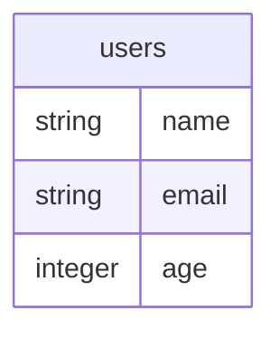
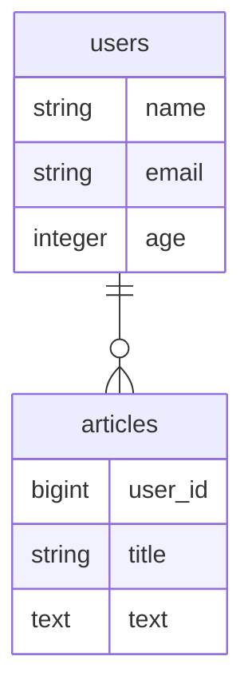
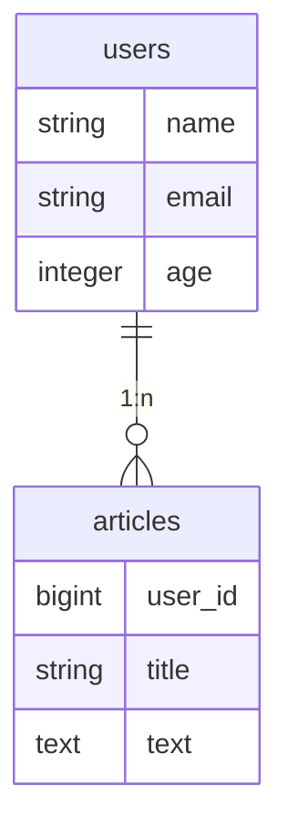
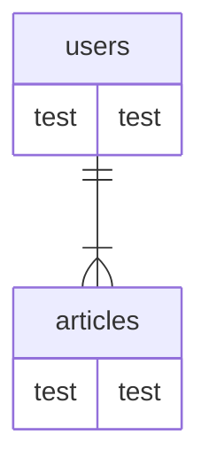
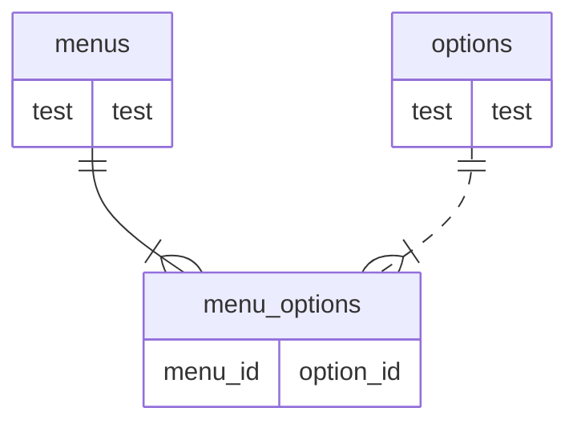

昨年末、Notionでmermaidを利用した図が描けるようになりました。
https://www.notion.so/Notion-Diagrams-6d8bd0a3a0e442e2bd092fa77e8199aa#3c28c8e9f6f04d8fb88ddb2adc9519fc

それから今年はGitHub。
https://github.blog/2022-02-14-include-diagrams-markdown-files-mermaid/

ただなんとなく、
「mermaidって難しいんでしょう？」
「図を描くなんてどうやるねん」
そんな固定観念がありました。

しかし弊社は絶賛新サービスの開発中！
これからDB設計していくぞ！
なフェーズだったので使ってみたらとんでもなく簡単に使えてびっくりしました。

# 書き方
## テーブルを作る
驚きの簡単さ。
```
erDiagram

users {
  string name
  string email
  integer age
}
```
↓


まず`erDiagram`を宣言します。
次にJavaScriptでいうオブジェクトを作るように型とカラム名をスペース区切りで定義します。

**これだけ！！**
もう表を作ってあーしてこーしてなんてできません。

## リレーションを描く
ユーザーが記事を複数持てる状況を想定し、1:多のER図を作成します。
```
users ||--o{ articles: ""

users {
  string name
  string email
  integer age
}

articles {
  string title
  text text
}
```

↓



まず`articles`テーブルをusersと同じように作りました。
次にリレーションを張るために以下のコードを書いています。
```
users ||--o{ articles: ""
```
さっそく呪文に見える形ですが問題ありません。
ER図を見てみると気づくはずです。

形がそっくり！

分解するとこのようになります。

```
users ||--o{ articles: ""

"||" -> 1
"--" -> テーブルを繋げる線
"o{" -> 0 or n
```

またリレーション先のダブルクォートに文字を入れると、線上にコメントが入ります。
```
users ||--o{ articles: "1:n"
```


## ER図の記号をおさらい
関係性はこの通り
[やさしい図解で学ぶ　ER図　表記法一覧](https://qiita.com/ramuneru/items/32fbf3032b625f71b69d)より


`1`を表したいときは`|`を使います。
`多`を表したいときは`{`または`}`を使います。
`0`を表したいときは`o`を使います。

これさえ覚えてしまえばあとは思いのまま書くだけです！

1:0or1
```
erDiagram

users ||--o| articles: ""

users {
  test test
}

articles {
  test test
}
```


1:n（0はないパターン）
```
erDiagram

users ||--|{ articles: ""

users {
  test test
}

articles {
  test test
}
```


中間テーブルの場合
```
erDiagram
menus ||--|{ menu_options: ""
ドットにすると破線になる
options ||..|{ menu_options: ""
menus {
  test test
}

options {
  test test
}

menu_options {
  menu_id
  option_id
}
```

# mermaidで書くことの何がいいかって
## 全て文字で描けるので表（セル）について考えることが一切ない
楽。
## 追加・更新・削除が簡単になる
メンバーと話し合いながらの修正もささっと。
## リレーションの線を引っ張る必要がない
図を描くアプリケーションを触っていると「この線変なところから生えてるからドラッグして修正して~」といった場面がでてきますが、mermaidならいい感じに引っ張ってくれます。

# あとがき
なんか難しそうだし、必須で覚えなくてもいいものだし・・と思っていましたが学習コストが極端に少なくコスパの良さ驚きました。
mermaidには他の図式を書くための記法がまだまだあるので、機会があれば触りたいと思います。

# あとがきのあとがき
弊社、WEBエンジニア募集中です！！
https://diddyworks.co.jp/recruit
